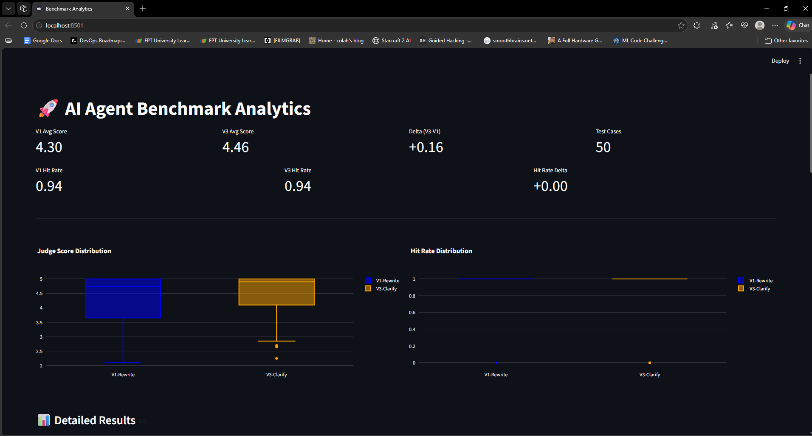

# 🚀 Lab Day 14: AI Evaluation Factory (Team Edition)

**Nhóm thực hiện:** Nguyễn Bình Thành (2A202600138) · Hàn Quang Hiếu (2A202600056) · Phan Anh Khôi (2A202600276)

## 🎯 Tổng quan
Nhóm mình xây dựng một **hệ thống benchmark AI Agent** dựa trên data RAG của XanhSM FAQ. Bài làm tập trung vào việc đo rõ chất lượng retrieval, chất lượng trả lời và độ ổn định giữa các phiên bản agent, để thấy agent đang tốt ở đâu và còn lỗi ở đâu.

---

## 📚 Tài liệu quan trọng
- [Group report - failure analysis](analysis/failure_analysis.md)
- [Reflection - Nguyễn Bình Thành](reflection_NguyenBinhThanh.md)
- [Reflection - Hàn Quang Hiếu](analysis/reflections/reflection_HanQuangHieu.md)
- [Reflection - Phan Anh Khôi](analysis/reflections/reflection_PhanAnhKhoi.md)
- [Benchmark summary](reports/summary.json)
- [Benchmark results](reports/benchmark_results.json)
- [Regression cases](reports/regression_cases.txt)

---

## 🔧 Hướng dẫn chạy & reproduce nhanh

```bash
pip install -r requirements.txt

# Tạo file .env với OPENAI_API_KEY

# Chạy benchmark
python main.py

# Mở dashboard trực quan
streamlit run dashboard.py

# Kiểm tra định dạng trước khi nộp
python check_lab.py
```



---

## ⚠️ Lưu ý quan trọng
- Nếu bản clone của bạn chưa có sẵn `.chromadb` hoặc `data/golden_set.jsonl`, hãy tạo lại dữ liệu trước khi chạy benchmark.
- `python main.py` sẽ tạo sẵn toàn bộ file trong `reports/` để giám khảo xem lại.
- Trước khi nộp bài, hãy chạy `python check_lab.py` để đảm bảo định dạng dữ liệu đã chuẩn. Bất kỳ lỗi định dạng nào dẫn đến việc script chấm điểm tự động không chạy được sẽ bị trừ 5 điểm thủ tục.
- File `.env` chứa API Key **KHÔNG** được push lên GitHub.

---
*Chúc nhóm bạn xây dựng được một Evaluation Factory thực sự mạnh mẽ!*
